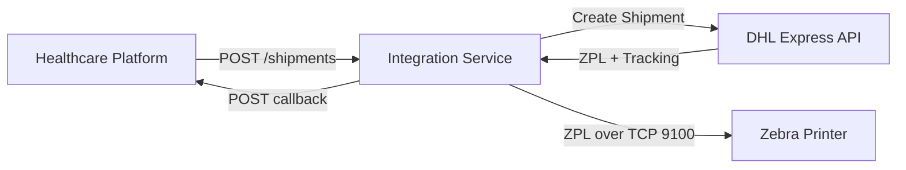
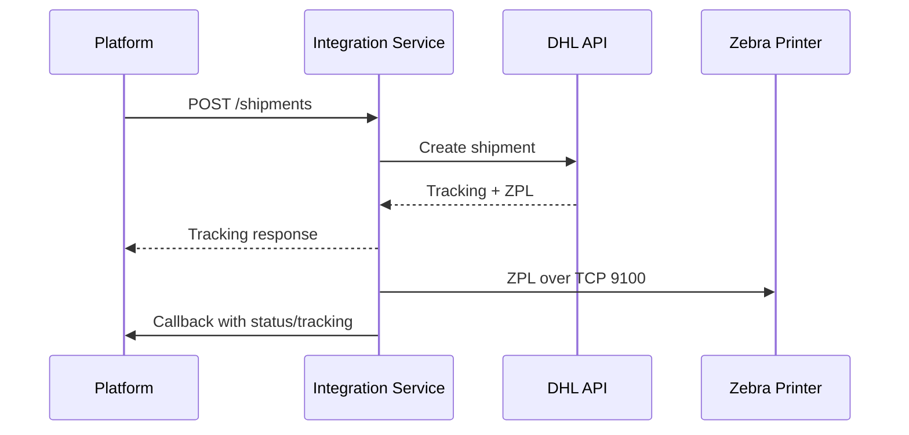

# DHL Express + ZPL Label Integration – Architecture

## Context and Goals
- Service for a NL pharmacy to create DHL Express shipments, fetch ZPL labels, print to a networked Zebra printer (port 9100), and return tracking info to the healthcare platform.
- Production-grade clarity: configuration, logging, and error handling.

## Scope
- In: DHL shipment creation, ZPL retrieval, raw TCP printing, tracking return via API/webhook, healthcheck, configuration instructions.
- Out (not covered): warehouse UI, rate shopping, returns workflows, complex routing rules.

## High-Level Architecture
- Stateless REST service (Node.js or .NET), containerizable, runs behind TLS.
- Integrations: DHL Express (MyDHL REST preferred; XML if required), Zebra printer via TCP 9100, healthcare platform callback.
- Optional durability for audit/idempotency and print retries.

## Core Components
- API endpoints for shipment creation, label print trigger, healthcheck.
- DHL client for auth, shipment creation, ZPL label retrieval, tracking.
- Print service to stream ZPL over TCP 9100 with timeout and retry/backoff.
- Callback handler to return tracking/status to the healthcare platform.
- Optional persistence for audit records, idempotency keys, and print job states.

## Data Flows
- Happy path:
  1) Platform calls `POST /shipments`.
  2) Service creates shipment via DHL; receives tracking + ZPL.
  3) Service returns tracking to platform; triggers print.
  4) Print service sends ZPL to printer (9100); records result.
  5) Service posts callback with tracking/status.
- Failure handling: map DHL errors to caller, retry/backoff on print failures, timeouts on HTTP/TCP, optional circuit breaker for DHL.

## API Surface (draft)
- `POST /shipments` → create DHL shipment, return `{shipmentId, trackingNumber, labelId, status}`.
- `POST /labels/:labelId/print` (or `/shipments/:id/print`) → trigger print, return `{printJobId, status}`.
- `POST /prints/:printJobId/retry` → retry a failed print job.
- `GET /health` → readiness/liveness.
- Outbound callback to platform: tracking/status payload with signature or API key.

## Configuration
- DHL: `DHL_API_BASE`, `DHL_CLIENT_ID`, `DHL_CLIENT_SECRET` (or XML credentials).
- Printer: `PRINTER_HOST`, `PRINTER_PORT=9100`.
- Platform: `CALLBACK_URL`, `API_KEY` (for securing inbound calls to this service).
- Timeouts and retries: `HTTP_TIMEOUT_MS`, `PRINT_TIMEOUT_MS`, retry/backoff counts; log level.
- Optional: `DB_URL` for audit/idempotency; `REDIS_URL` for print queue.

## Security and Reliability
- TLS termination, restricted printer subnet; secrets via env/secret store; redact sensitive data and avoid PHI in logs.
- Payload validation; idempotency using caller-provided key; audit logs of shipment and print actions.
- Retries with backoff; bounded attempts; graceful TCP shutdown; circuit breaker for repeated DHL failures.

## Observability and Health
- Structured JSON logs with correlation/request IDs; record DHL request ID when present.
- Metrics: request rates, latency, error counts, print success/failure counts.
- `/health` wired for liveness/readiness (optionally depends on DHL connectivity).

## Deliverables
- Working service with REST endpoints for shipment creation and label printing.
- ZPL label retrieval and direct print to networked Zebra (TCP 9100).
- Callback to return tracking/status.
- Configuration instructions for DHL credentials and printer IP/port.
- API/service documentation (OpenAPI) and sample requests.
- Basic admin endpoint/CLI for test print.
- Test coverage for DHL sandbox, ZPL passthrough, and print pipeline.

## Required Screening Question
- Have you previously built a DHL Express integration that prints ZPL labels directly to a Zebra (or similar) label printer? If yes, please briefly describe the project. Yes, but not with DHL API's.

