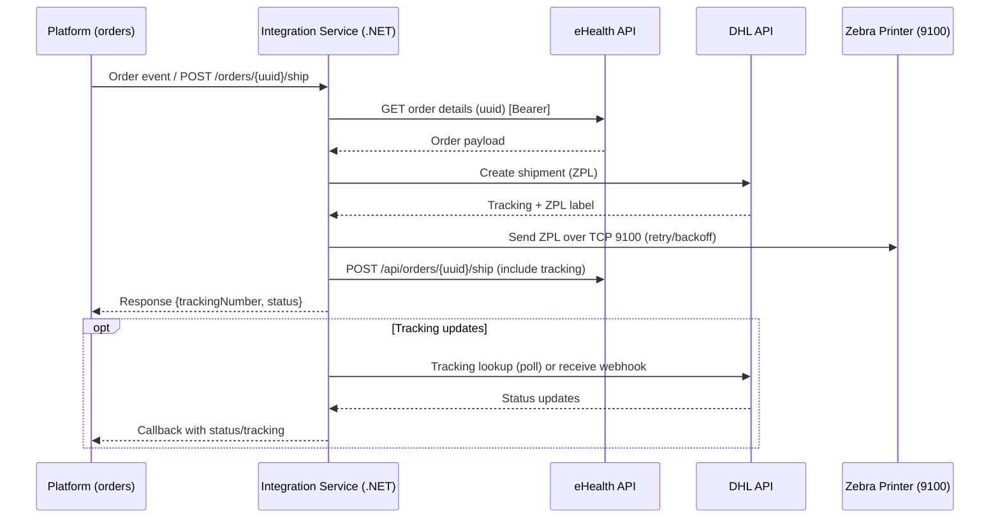

# Build Plan – eHealth Ventures API Integration + DHL/ZPL (.NET Core)

## Objectives
- Integrate the pharmacy platform with eHealth Ventures APIs (auth + supplier/store endpoints) to fetch/process orders.
- Create DHL Express shipments, receive ZPL labels, and print directly to a Zebra (TCP 9100).
- Expose a small, reliable API for order → shipment → print → tracking callback.

## Stack and Patterns
- ASP.NET Core Web API (C#), minimal APIs or controllers; DI throughout.
- HttpClientFactory typed clients (Refit optional) for eHealth and DHL; Polly for retry/backoff/timeout/circuit breaker.
- JSON serialization via System.Text.Json; FluentValidation for request validation.
- Logging via ILogger/Serilog; health checks via `Microsoft.Extensions.Diagnostics.HealthChecks`.
- Config: `appsettings.{env}.json` + environment variables; secrets in User Secrets/KeyVault.

## External APIs (contracts to implement)
- eHealth Auth (client credentials): obtain bearer token. Ref: [`authentication-getting-started`](https://docs.ehealthventuresgroup.com/reference/authentication-getting-started)
  - Request: `POST /oauth/token` (per their auth server), body includes `client_id`, `client_secret`, `audience`, `grant_type=client_credentials`.
  - Response: `{ access_token, token_type, expires_in }`; cache until expiry minus skew.
- eHealth Supplier (Bearer required):
  - `GET /api/orders` (if listing) and/or `GET /api/orders/{uuid}` to fetch order data (meds, recipient, status).
  - `POST /api/orders/{uuid}/ship` to mark shipped after DHL label creation. Ref: [`shiporder`](https://docs.ehealthventuresgroup.com/reference/shiporder)
  - Optional flows: `POST /api/orders/{uuid}/deliver`, `/cancel`, `/return`, `/process`, `/unprocess`, `/recall` (if used).
- eHealth Store (optional, if using their shipping helpers):
  - `POST /api/store/shipments` variants such as “Create shipment with UUID”, “Reship order”, “Update notify URL”.
- DHL Express (based on provided creds):
  - Auth: MyDHL REST OAuth or XML auth fields.
  - Shipment creation: request includes shipper/recipient, service code, packages, label format `ZPL`.
  - Label retrieval: ZPL inline or via label link; must handle both.
  - Tracking: tracking status lookup for callbacks or polling.

## High-Level Architecture
- API Layer: internal endpoints to receive order events/commands, trigger DHL shipment, stream ZPL to printer, and return status.
- Integration Services:
  - `EHealthAuthClient`: token acquisition + caching (expiry-aware refresh).
  - `EHealthOrdersClient`: supplier/store operations (ship, deliver, cancel, etc.).
  - `DhlClient`: create shipment, fetch ZPL label, tracking lookup.
  - `PrintService`: TCP 9100 sender with retries/backoff and result logging.
- Callbacks: webhook to the healthcare platform with tracking/status (signed/API-key secured).
- Optional persistence: audit/idempotency records; print job states; correlation IDs.

## eHealth Contract Details (for implementation)
- Auth headers: `Authorization: Bearer {token}`.
- Order identifier: `uuid` path parameter.
- Expected order payload fields to map to DHL: recipient name/address, phone/email, line items/weights; confirm required fields and country codes.
- Ship action (`POST /api/orders/{uuid}/ship`): send after successful DHL shipment creation; include tracking number if supported in body or follow-up call if required.
- Notify URL: if using `Update notify URL`, confirm URL and signing method (API key vs HMAC).

## DHL Contract Details (assumed MyDHL REST)
- Request: shipper (NL pharmacy), receiver (patient), product/service codes, package weight/dimensions, label format `ZPL`.
- Response: tracking number(s), label(s) (base64 ZPL or URL). Handle multi-piece shipments.
- Error contract: capture DHL request ID and error codes; surface to logs and mapped problem details.

## API Surface (internal)
- `POST /orders/{uuid}/ship` → call eHealth ship, create DHL shipment, return `{trackingNumber, labelId, status}`.
- `POST /orders/{uuid}/labels/{labelId}/print` → send ZPL to printer; return print job status.
- `POST /prints/{jobId}/retry` → retry a failed print job.
- `POST /callbacks/dhl` (optional) → receive DHL events if available; otherwise poll tracking.
- `GET /health` → liveness/readiness (optionally check downstreams).

## Data Models
- Typed requests/responses for eHealth supplier/store endpoints (UUID-based order IDs).
- DHL shipment request/response models (shipper/recipient, parcels, service codes, label format ZPL).
- Print job record: `{jobId, orderUuid, labelId, printerHost, status, attempts, lastError}`.

## Error Handling & Reliability
- Map eHealth and DHL errors to structured problem details; include correlation/request IDs when provided.
- Polly policies: retry w/ exponential backoff for transient HTTP/TCP; timeouts per call; circuit breaker around DHL if repeated failures.
- Idempotency keys on shipment creation (client-provided or generated) to avoid duplicate labels.
- Printer retries bounded; mark jobs failed with clear reason for operator action.

## Security
- Bearer token for eHealth; secure storage of client ID/secret.
- TLS everywhere; restrict printer subnet; no PHI in logs; redact secrets.
- API auth: API key or JWT for internal endpoints; request validation on all inputs.

## Observability
- Structured JSON logs with correlation IDs across eHealth, DHL, and print operations.
- Metrics hooks (requests, latency, error rates, print success/failure counts) if target platform supports it.
- Health checks for downstream reachability (configurable to avoid hard dependency in liveness).

## Configuration
- eHealth: `EHEALTH_BASE_URL`, `EHEALTH_CLIENT_ID`, `EHEALTH_CLIENT_SECRET`, `EHEALTH_AUDIENCE`.
- DHL: `DHL_API_BASE`, `DHL_CLIENT_ID`, `DHL_CLIENT_SECRET` (or XML creds), label format `ZPL`.
- Printer: `PRINTER_HOST`, `PRINTER_PORT=9100`, `PRINT_TIMEOUT_MS`, retry counts.
- Platform callback: `CALLBACK_URL`, `CALLBACK_API_KEY` (for signing/verification).
- Logging: log level, sample rate; `HTTP_TIMEOUT_MS` per client.

## Testing Strategy
- Unit tests: auth client, order client, DHL client, print service (socket mocked), retry/backoff policies.
- Integration tests: wiremock/testserver for eHealth and DHL flows; verify auth token usage and error mapping.
- Printer dry-run mode for CI (no TCP send).
- UAT: connect to eHealth test env + DHL sandbox; real printer test for one label.

## Rollout Steps
- Skeleton project: solution setup, configs, health check, logging.
- Implement eHealth auth + order client (typed models), then DHL client.
- Wire `POST /orders/{uuid}/ship` to: eHealth ship → DHL create shipment → fetch ZPL → print → callback.
- Add retries/backoff, idempotency, and error contracts.
- Add tests and sample requests (HTTP files or Postman collection).
- Deploy to dev/stage; run UAT with provided credentials; refine logging and policies.

## Timeline (estimate)
- 3–4 business days: clients, core endpoints, ZPL print path, tests.
- 1–2 business days: UAT, polish, docs/runbook.
- Total ≈ 1 week, assuming timely credentials and stable API scope.

## Assumptions / Inputs Needed
- eHealth credentials (client ID/secret, audience, test base URL) and list of required supplier/store actions.
- DHL credentials and target label format (ZPL confirmed); printer IP/port reachable from service.
- Preferred deployment target and secret store.

## Deliverables
- Source code (ASP.NET Core) with typed clients, retry policies, and print service.
- API documentation/OpenAPI and sample requests.
- Configuration and operations guide (runbook), including credential rotation and printer troubleshooting.

## Sequence Diagram (incl. printer)


## Contract Data Types (draft, align with final API specs)
- eHealth Auth request (client credentials):
```json
{
  "client_id": "<id>",
  "client_secret": "<secret>",
  "audience": "<audience>",
  "grant_type": "client_credentials"
}
```
- eHealth Auth response:
```json
{ "access_token": "<token>", "token_type": "Bearer", "expires_in": 3600 }
```
- eHealth Order detail (expected fields to map to DHL):
```json
{
  "uuid": "<order-uuid>",
  "recipient": {
    "name": "Jane Doe",
    "address": { "street": "...", "city": "...", "postalCode": "...", "country": "NL" },
    "phone": "...",
    "email": "..."
  },
  "lines": [{ "sku": "...", "qty": 1, "weightGrams": 200 }],
  "references": { "customerRef": "...", "orderRef": "..." }
}
```
- eHealth Ship order request: `POST /api/orders/{uuid}/ship` (body often empty or minimal; confirm if tracking should be sent here).

- DHL Create shipment request (illustrative):
```json
{
  "shipper": { "name": "...", "address": { "countryCode": "NL", "postalCode": "...", "city": "...", "streetLines": ["..."] } },
  "recipient": { "name": "Jane Doe", "address": { "countryCode": "NL", "postalCode": "...", "city": "...", "streetLines": ["..."] }, "phone": "...", "email": "..." },
  "packages": [{ "weight": { "value": 0.2, "unit": "KG" }, "dimensions": { "length": 20, "width": 15, "height": 5 } }],
  "productCode": "<service>",
  "labelFormat": "ZPL"
}
```
- DHL Create shipment response (illustrative):
```json
{
  "trackingNumber": "JD014600006543210000",
  "label": { "format": "ZPL", "content": "<base64-zpl>" },
  "shipmentId": "...",
  "pieces": [{ "trackingNumber": "...", "label": { "content": "..." } }]
}
```
- Print request (internal): `POST /orders/{uuid}/labels/{labelId}/print`
```json
{ "printerHost": "10.0.0.50", "printerPort": 9100, "labelZpl": "<raw zpl>", "jobId": "<uuid>" }
```
- Print response:
```json
{ "jobId": "<uuid>", "status": "queued|sent|failed", "attempts": 1, "lastError": null }
```
- Tracking callback (internal → platform, illustrative):
```json
{
  "orderUuid": "<uuid>",
  "trackingNumber": "JD0146...",
  "status": "InTransit",
  "lastUpdate": "2024-01-01T10:00:00Z",
  "events": [{ "code": "PU", "description": "Picked up", "time": "..." }]
}
```

> Final field names may vary; align with eHealth and DHL schemas once confirmed. Add signatures/API keys to callbacks as required.

## Questions for the Client
- eHealth usage
  - Which supplier/store endpoints are in scope beyond `ship` (deliver, cancel, return, recall, reship, notify URL updates)?
  - Do we pull orders via `GET /api/orders`/`GET /api/orders/{uuid}` or will the platform push orders to us?
  - What order fields are guaranteed (recipient address, phone/email, weight, service level, reference IDs)?
  - Should we update notify URL via their API, and how should callbacks be signed/secured?
- DHL specifics
  - Credentials type (MyDHL REST OAuth vs XML); target base URL (sandbox/prod).
  - Required service/product codes, incoterms, and label format (ZPL confirmed? size?).
  - Single- vs multi-piece shipments; need for paperless trade or customs docs?
  - Tracking: prefer webhook from DHL (if available) or polling cadence?
- Printing
  - Printer host/IP/port 9100 reachable from the service? Any authentication on printer network?
  - Label size/rotation requirements; need for test-print endpoint?
  - How many retries on print failures before operator intervention?
- Security/ops
  - Preferred auth for our internal endpoints (API key/JWT/IP allowlist).
  - Secret storage choice (KeyVault/other); logging/PII redaction requirements.
  - Deployment target and observability stack (logs/metrics/alerts).
  - Non-functional targets: SLA, timeouts, rate limits we should honor.

